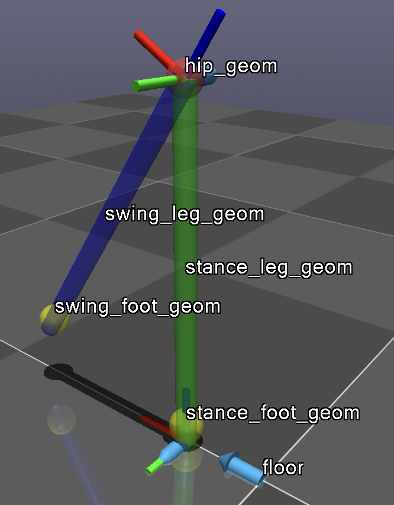
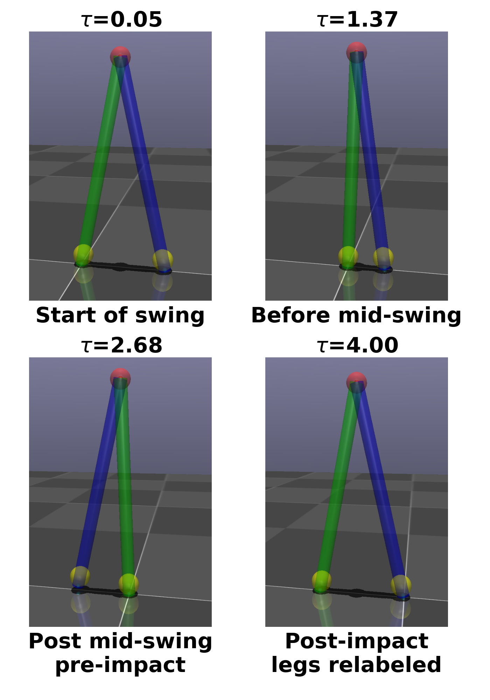

# Compass Gait Walker

This repository demonstrates the passive dynamic compass gait walker demonstrated in my thesis.

## Setup
Prerequisites: python3, MuJoCo (Python API), numpy, matplotlib, scipy

Model: `bipedCompass1.xml`

  
   
  Model

Script: `bipedCompassCanon3.py`

## Running
- Run `python3 bipedCompassCanon3.py` to visualize on MuJoCo and load the plots. Expected:

  <a href="Compass-2steps.mov">
    <video src="Compass-2steps.mov" width="500" title="Click to enlarge">
  </a>
   
  Expected output

  
   
  Compass Walker

## Next Steps
Enable MuJoCo contact for dynamic walking (not just kinematic playback). Trying with `bipedCompassMJ.py`

